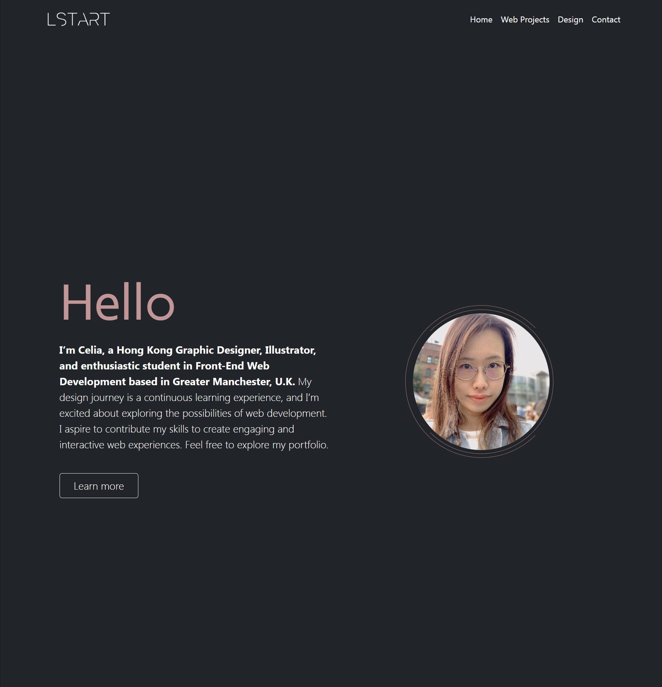
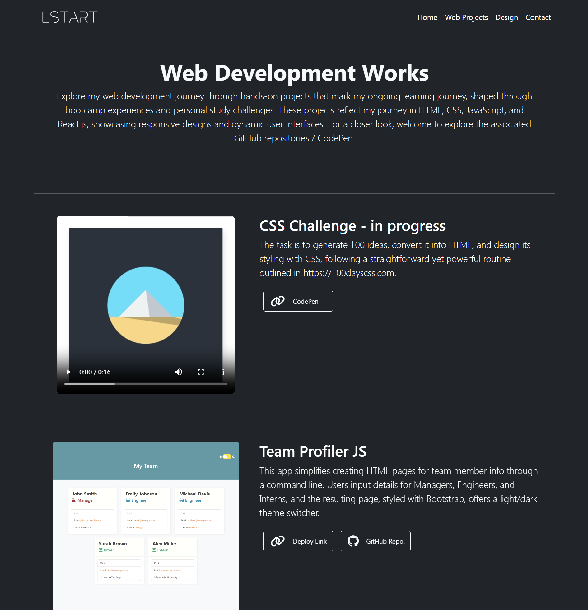
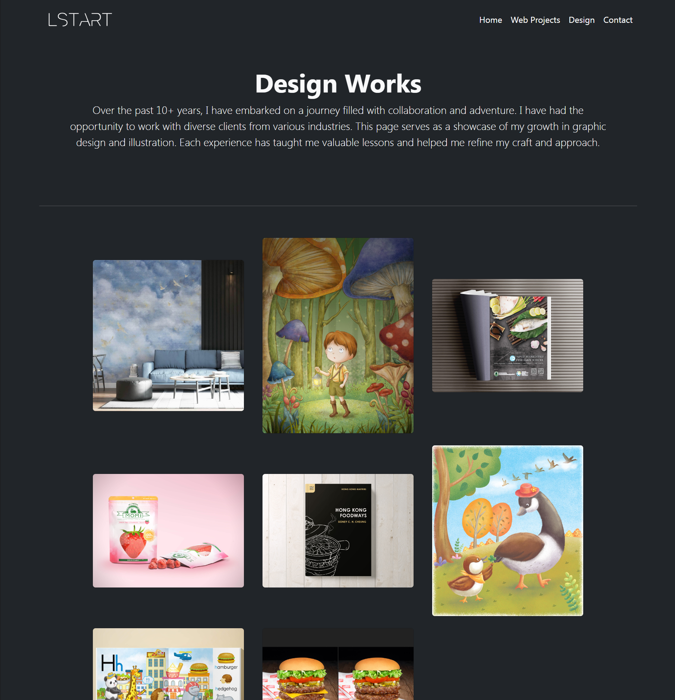
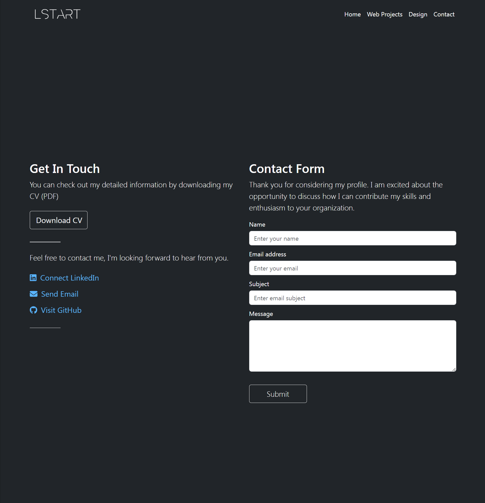

# LSTART-React-Portfolio

## Description
Celia's Portfolio is a web application built using React, which is aimed at displaying Celia's creativity across various fields like graphic design and web development, while also providing an easy way to connect with her. During the development process, I encountered some challenges, especially with the lightbox gallery on the Design Gallery page. The default behaviour of the React Lightbox caused issues with image loading, especially on smaller screens.

To solve these problems, I implemented optimizations in image loading using CSS. While the loading time for the first image in the Lightbox may be slightly longer, these enhancements have significantly improved the Lightbox's overall functionality. Users can now enjoy a smoother experience when interacting with design items.

My commitment to the continual refinement and expansion of Celia's portfolio remains unwavering. Future updates will introduce new features, address any raising challenges, and maintain a better user experience. Thank you for exploring Celia's Portfolio!

## Table of Contents

- [Installation](#installation)
- [License](#license)
- [Features](#features)
- [Reference](#reference)
- [Questions](#questions)

## Installation

To run Celia's Portfolio locally on your machine, follow these steps:
  1. Clone the repository: <a href="https://github.com/celia103/LSTART-React-Portfolio" target="_blank">The URL of the GitHub repository</a>
  2. Run 'npm install' to install dependencies.

The URL of the deployed application:
<a href="https://celia103.github.io/LSTART-React-Portfolio/#/" target="_blank">https://celia103.github.io/LSTART-React-Portfolio/#/</a>

## License

MIT License

## Features

1. **Home Page**
- **Introduction:** A warm introduction providing insights into Celia's background, skills, and enthusiasm for design and web development.
- **Profile Photo:** A visually striking profile photo, creating a personal connection with the audience.
Learn More: A call-to-action button directing users to explore Celia's projects.

2. **Projects Gallery:**
- **Web Development Works:** 
A dedicated section highlighting Celia's journey in web development. Projects are presented with detailed descriptions, screenshots, and links to live deployments and GitHub repositories.
- **Responsive Designs:** 
Each project showcases responsive designs and dynamic user interfaces, reflecting proficiency in HTML, CSS, JavaScript, and React.js.

3. **Design Gallery:**
- **Graphic Design Showcase:** An exhibition of Celia's graphic design and illustration works.
- **Lightbox Gallery:** Users can explore each design in detail through a lightbox gallery, providing a closer look at Celia's growth and skills in graphic design.

4. **Contact Page:**
- **Get In Touch:** A contact form for users to reach out, providing a seamless way to connect with Celia.
- **Download CV:** Users can download Celia's detailed CV in PDF format for additional information.
- **Social Links:** Direct links to Celia's LinkedIn, Email, and GitHub profiles, making it easy for users to connect and stay updated.

## Technologies Used

1. **React:** The application is built using the React library, allowing for efficient component-based development and seamless navigation.
2. **React Router:** Navigation between different sections of the portfolio is managed using React Router.
3. **Bootstrap:** The application leverages Bootstrap for responsive and visually appealing design elements.
4. **FontAwesome:** Icons from FontAwesome are incorporated to enhance the visual presentation.
5. **EmailJS:** Contact form submissions are handled using EmailJS, ensuring reliable communication.
6. **React-18-image-lightbox:** The lightbox gallery on the Design Gallery page is implemented using the react-18-image-lightbox component. This library enhances the viewing experience for graphic design and illustration works.

## Reference

- **EmailJS:**
  <a href=" https://www.emailjs.com/docs/tutorial/creating-contact-form/
  " target="_blank"> https://www.emailjs.com/docs/tutorial/creating-contact-form/
  </a>
- **Fix Lightbox issues**
<a href=" https://github.com/frontend-collective/react-image-lightbox/issues/91
" target="_blank"> https://github.com/frontend-collective/react-image-lightbox/issues/91
</a>

- **stackoverflow**
<a href=" https://stackoverflow.com/" target="_blank"> https://stackoverflow.com/</a>

## Questions
If you have any questions or need further clarification, feel free to open an issue or contact directly:

<a href="mailto:celiayych@gmail.com" target="_blank">Celia's Email</a>
